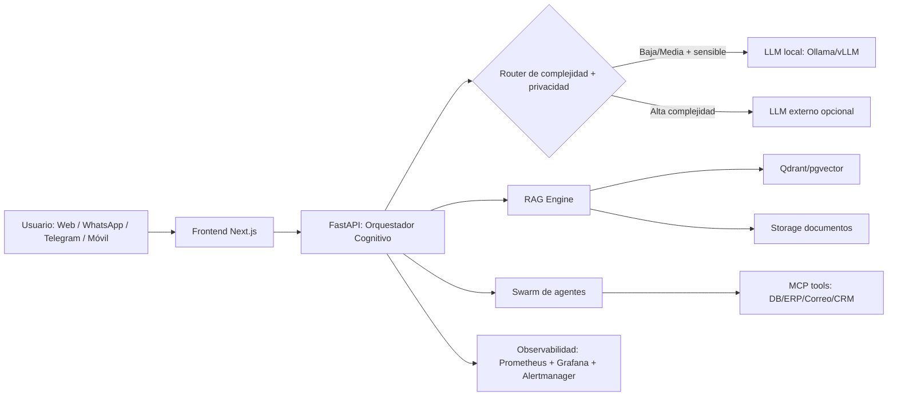

# Archivo Maestro Sonora Digital Corp
## Estrategia integral: bot soberano, agentes, RAG, operación y escalabilidad

> Versión: 1.0  
> Idioma: Español  
> Propósito: Documento base para diseñar, vender, implementar y operar una solución AI soberana para PYMEs y empresas medianas/grandes.

---

## 1) Resumen ejecutivo (en pocas palabras)

**Qué vendes:**
- No vendes “chatbot”; vendes **capacidad operativa autónoma** (agentes + automatización + memoria institucional).

**Qué te diferencia:**
- **Soberanía de datos**: cada cliente en su propia infraestructura.
- **Costo controlado**: prioridad de inferencia local, nube solo para casos premium.
- **Escalabilidad real**: arquitectura por nodos, alertas de capacidad y plan de crecimiento por etapas.

**Cómo generas dependencia sana (sin lock-in abusivo):**
- El valor está en la **curación continua** (RAG, workflows, criterios de negocio, tuning de agentes), no en secuestrar el código.

---

## 2) Principios rectores

1. **Soberanía primero**: datos del cliente se procesan localmente por defecto.
2. **Nube como acelerador, no como muleta**: usar APIs externas solo cuando la tarea lo justifique.
3. **Arquitectura auditable**: toda decisión técnica deja rastro (logs, métricas, versionado).
4. **Resiliencia por diseño**: degradación elegante si falla un modelo/servicio.
5. **Valor acumulativo**: cada interacción mejora procesos del cliente (memoria operativa).

---

## 3) Arquitectura objetivo (híbrida soberana)

### Capas
- **Interfaz**: chat y panel operativo (KPIs + estado de agentes).
- **Orquestación**: enrutador de tareas (privacidad, costo, SLA).
- **Inteligencia**: LLM local + LLM externo opcional.
- **Memoria**: RAG con fuente documental y metadata.
- **Ejecución**: agentes y herramientas MCP con permisos.
- **Control**: monitoreo, alertas, respaldo y auditoría.

---

## 4) RAG de 5 etapas (estándar de calidad)

1. **Ingesta**
   - Entradas: PDF, XML, CSV, correos, políticas internas, ERP.
2. **Chunking**
   - Fragmentación por estructura semántica (título, sección, tabla, fecha).
3. **Embeddings**
   - Vectorización con modelo consistente por dominio.
4. **Retrieval híbrido**
   - Búsqueda semántica + keyword + filtros por cliente/fecha/área.
5. **Generación con evidencia**
   - Respuesta con citas internas y nivel de confianza.

**Reglas mínimas de auditoría RAG**
- Precisión factual >= 90% en conjunto de pruebas.
- Trazabilidad de fuente en >= 95% de respuestas críticas.
- Reindexación programada y control de versiones del corpus.

---

## 5) Swarm de agentes (equipos)

### Roles base
- **Agente Líder**: planifica, divide trabajo, valida salida final.
- **Agente Analista**: extracción y normalización de datos.
- **Agente Auditor**: reglas de negocio, cumplimiento, anomalías.
- **Agente Ejecutor**: actúa vía MCP (tickets, correo, ERP, CRM).
- **Agente Tutor**: genera cápsulas de aprendizaje para ti/equipo.

### Protocolo de ejecución
1. Clasificar solicitud (operativa / estratégica / sensible).
2. Construir plan de subtareas.
3. Ejecutar subtareas en paralelo cuando aplique.
4. Validar consistencia cruzada (analista vs auditor).
5. Entregar resultado + acciones + evidencia + costo inferido.

### Guardrails
- Lista de acciones prohibidas sin aprobación humana.
- Escalado automático a humano para operaciones de alto impacto.
- Registro completo de decisiones de agente.

---

## 6) Escalabilidad real: cuándo “se va al carajo” y cómo evitarlo

## Riesgos de ruptura
- RAM saturada (contexto excesivo o concurrencia alta).
- Contención CPU/GPU por picos de usuarios.
- Base vectorial degradada (índices sucios / embeddings inconsistentes).
- Agentes sin límites de permisos (riesgo operativo).

## Controles preventivos
- Cola de tareas (priority queue) y rate limiting por cliente.
- Presupuestos de contexto por sesión y truncamiento inteligente.
- Autoscaling por métricas (CPU, RAM, latencia P95, tokens/s).
- Circuit breaker para derivar a fallback (modelo local ligero).

## Umbrales sugeridos (alertas)
- RAM > 80% por 10 min.
- Latencia P95 > 6 s en consultas críticas.
- Error rate > 2% en tool-calls MCP.
- Saturación de cola > 50 tareas pendientes.

---

## 7) Soberanía operativa por tamaño de cliente

## Cliente pequeño (MVP soberano)
- 1 nodo (16-32 GB RAM), LLM local 7B/8B.
- 1 entorno Docker Compose.
- SLA básico y monitoreo ligero.

## Cliente mediano
- 2-3 nodos, RAG robusto, colas y observabilidad completa.
- Separación por ambientes (dev/stage/prod).
- Swarm con 3-5 agentes de negocio.

## Cliente grande
- Orquestación en Kubernetes (k3s/EKS).
- Segmentación por unidades de negocio y políticas Zero Trust.
- GPU dedicada o pool de inferencia local.
- DRP (plan de recuperación) y auditoría formal.

---

## 8) Modelo de costos (estimación orientativa)

## CAPEX/OPEX inicial
- Infra base cliente mediano: **USD 150–500/mes** (sin GPU premium).
- Infra con GPU dedicada: **USD 350–1,500/mes** según carga.
- Implementación inicial (arquitectura + despliegue + RAG + agentes): paquete de proyecto.

## Rubros de costo
1. Infraestructura (compute, storage, red).
2. Operación (monitoreo, backups, soporte).
3. Evolución (nuevos agentes, tuning, integraciones).
4. Opcional nube externa (LLM premium para casos puntuales).

## Política sana de pricing
- Cuota base por operación + bolsa de mejora continua.
- Costos externos transparentes y auditables.
- Descuentos por estandarización multi-sede.

---

## 9) Workflow continuo para ti (operación diaria)

## Rutina propuesta (diaria)
1. **Sesión AM (15-20 min):** salud del sistema, alertas y prioridades.
2. **Sesión MID (20 min):** revisión de productividad por cliente.
3. **Sesión PM (20 min):** decisiones de arquitectura, backlog y capacitación.

## Modo comando (terminal + móvil)
- **Terminal (Claude/CLI):** diagnóstico profundo, incidentes, cambios técnicos.
- **Móvil (OpenClawd):** aprobaciones rápidas, resúmenes ejecutivos, alertas críticas.

## Tutoría automática
- Agente Tutor entrega “micro-clases” con:
  - qué cambió,
  - por qué importa,
  - qué decisión debes tomar,
  - riesgo si no se actúa.

---

## 10) Plan de implementación de inicio a fin (90 días)

## Fase 0 (Semana 1): Descubrimiento
- Levantamiento de procesos, fuentes de datos y riesgos.
- Definición de casos de uso de alto retorno.

## Fase 1 (Semanas 2-4): Fundación técnica
- Infra, seguridad base, CI/CD, observabilidad.
- Primer RAG operativo con dataset controlado.

## Fase 2 (Semanas 5-8): Enjambre mínimo viable
- 3 agentes productivos (analista/auditor/ejecutor).
- Integración MCP con sistemas críticos (read-only al inicio).

## Fase 3 (Semanas 9-12): Escala y gobierno
- Políticas, SLAs, auditoría, runbooks.
- Paso gradual de read-only a write-controlado.

---

## 11) Auditoría integral (checklist ejecutivo)

- [ ] Seguridad: secretos, cifrado, control de acceso, rotación de llaves.
- [ ] Datos: segregación por cliente, respaldo, retención y borrado.
- [ ] Modelos: evaluación, fallback, versionado, drift.
- [ ] Agentes: permisos mínimos, aprobación humana, bitácora completa.
- [ ] RAG: calidad, latencia, cobertura y trazabilidad.
- [ ] Infra: capacidad, alertas, alta disponibilidad y recuperación.
- [ ] Negocio: ROI, adopción, tiempo ahorrado y tasa de error.

---

## 12) Presentación resumida (tipo PDF / PowerPoint)

## Slide 1 — Problema
- Empresas con procesos fragmentados y sobrecarga operativa.

## Slide 2 — Propuesta
- Bot soberano + RAG + Swarm de agentes sobre infraestructura del cliente.

## Slide 3 — Arquitectura
- Router cognitivo, LLM local por defecto, nube opcional.

## Slide 4 — Migración sin ruptura
- Read-only -> copiloto -> automatización controlada.

## Slide 5 — Escalabilidad y control
- Observabilidad, alertas de capacidad, decisiones de upgrade automáticas.

## Slide 6 — Economía
- Costos predecibles, reducción de tokens externos, utilidad por operación.

## Slide 7 — Gobierno y riesgo
- Guardrails, aprobación humana, auditoría completa.

## Slide 8 — Roadmap 90 días
- Valor visible en semanas, escalamiento disciplinado.

## Slide 9 — Oferta comercial
- Implementación + operación + mejora continua + formación ejecutiva.

## Slide 10 — Llamado a acción
- Iniciar piloto con 1 proceso crítico y métricas de impacto.

---

## 13) Decisión estratégica final

Si quieres **menos dependencia de APIs externas**, la ruta correcta es:
- subir calidad de inferencia local,
- usar APIs premium solo como respaldo estratégico,
- fortalecer tu ventaja en orquestación, datos y operación.

Esa combinación te da soberanía técnica, margen financiero y crecimiento sostenible.
